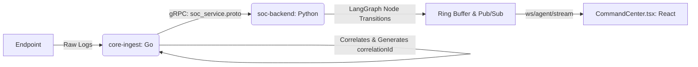

# Local Development Connectivity Guide

Because this project targets PaaS and "PaaS-like" remote droplets (Tier P2), we **never** expose production databases (Postgres, ClickHouse) directly on public IPs using just password authentication.

To connect to remote services securely from your local development machine, use one of the two methods below:

## Method 1: Tailscale (Recommended)

Tailscale operates a zero-config WireGuard mesh. By installing the Tailscale client locally, your development machine joins the same private network as the Tier P2 droplets.

1. Install Tailscale on your local machine (Windows/Mac/Linux).
2. Authenticate to the team's Tailscale network.
3. You can now access remote databases using their private `100.x.y.z` IP addresses (e.g., `100.64.0.2:5432`) exactly as if they were local.

**Why this is preferred:** It provides a seamless "always-on" experience for debugging without manual tunnel setup, and allows cross-communication with all Tier P2 nodes simultaneously.

## Method 2: SSH Port-Forwarding (Low-Overhead)

If you prefer not to install Tailscale, you can temporarily bridge your local machine to the remote droplet via an SSH tunnel. 

1. Ensure you have SSH key access to the remote Tier P2 droplet.
2. Run the following command to bind the remote Postgres port to your `localhost`:

```bash
ssh -L 5433:localhost:5432 root@<droplet-public-ip>
```

3. You can now connect your local DBeaver or scripts to `localhost:5433`.

**When to use this:** Ideal for quick, one-off database queries when you don't want to join the VPN mesh permanently.

---

## Endpoint Identity Lifecycle Policy

To manage diverse endpoints securely, we strictly follow an IoT-style device fleet identity model:

1. **Unique Issuance:** Each endpoint receives a unique, verifiable Cloudflare Access service token during the one-time `/api/endpoints/enroll` bootstrap flow. Shared secrets are strictly prohibited.
2. **Least Privilege Scoping:** An endpoint tagged as `paas` with `block_user` capabilities receives API scopes that only permit calling tasks/results related to that capability. Blanket credentials that allow unrelated actions (e.g., `isolate_host`) are prohibited.
3. **Decommissioning:** When an endpoint is retired, its service token is explicitly revoked in the Cloudflare dashboard, its row in the backend inventory is marked "decommissioned" (never deleted, to preserve audit continuity), and its local credentials are mathematically invalidated.
4. **Continuous Anomaly Monitoring:** The `core-ingest` pipeline monitors for anomalous identity behaviors (e.g., a `paas` agent attempting an `isolate_host` call, or checking in from an unexpected geo-IP), feeding these signals into the SOC dashboard as a compromised credential alert.

## Orchestration Architecture: Remote vs Local

There is **no meaningful architectural difference** between a "remote server" and a "local server" in our orchestration design. 

Once the enrollment flow (Bootstrap Token → Server-Issued Credential → Encrypted Local Storage) and the HTTP-Agent-over-Zero-Trust model are in place, **both** environments connect outbound-only. Both authenticate via a credential that was never manually handled or exposed to a browser, and both appear identically in the Asset Inventory UI.

The only operational difference is which control option applies based on capability:
- **Local and IaaS** endpoints typically support Option B (Cloudflare Tunnel webhook) because they can run persistent background tunnels.
- **PaaS** endpoints default to Option A (polling) because they cannot easily guarantee persistent inbound listeners.

Both patterns are equally secured by the bootstrap enrollment and credential model. The endpoint's registered `type` and `capabilities` fields—not its physical network location—determine its permitted orchestration flow.

---

## LangGraph Agent Operations: Cross-Service Data Boundary

The **Agent Operations Panel** (Command Center) visualizes the live AI triage decision-making process. It is critical to understand the architectural boundary between the Go ingestion tier and the Python AI tier for this feature:

1. **`core-ingest` (Go) is Strictly for Telemetry:** The Go service ingests, correlates, and normalizes raw telemetry. It generates the `correlationId`, but it **does not** participate in or emit LangGraph state events. The AI triage logic lives entirely in Python.
2. **ID Propagation:** The `correlationId` generated by `core-ingest` is passed via gRPC (`soc_service.proto`) to the `soc-backend`.
3. **Event Emission Pipeline:** The `soc-backend` (Python) handles the LangGraph execution. It emits state transitions (Ingest → Deobfuscation → LLMTriage → Action) wrapped with the original `correlationId` to an internal pub/sub ring buffer.
4. **WebSocket Isolation:** The frontend (`CommandCenter.tsx`) receives this live feed exclusively through `soc-backend` (`ws/agent/stream`). There is **no direct WebSocket connection** between the frontend and `core-ingest` for agent telemetry.

### Data Flow Diagram


