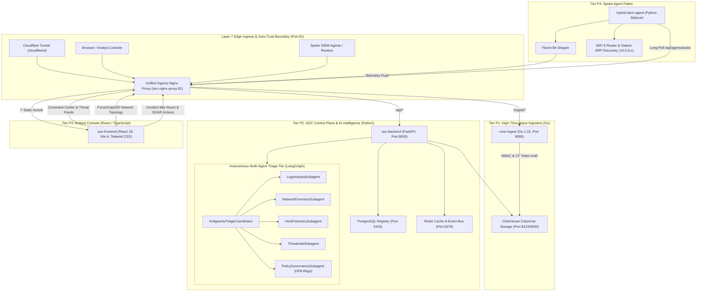

# Hybrid LLM Autonomous SOC, SIEM & SOAR Platform

[](https://opensource.org/licenses/MIT)
[](https://www.python.org/)
[](https://go.dev/)
[](https://reactjs.org/)
[](https://vitejs.dev/)
[](https://docs.docker.com/compose/)
[](https://www.cloudflare.com/zero-trust/)

An enterprise-grade, multi-tenant Autonomous Security Operations Center (SOC), Security Information & Event Management (SIEM), and Security Orchestration, Automation, and Response (SOAR) platform powered by a Hybrid Large Language Model (LLM) and autonomous multi-agent intelligence.

The platform provides millisecond log ingestion, distributed zero-trust spoke agent management, real-time WiFi 6 network topology discovery, deterministic OPA policy governance, two-key containment authorization, and deep interactive investigation graphs.

---

## Architecture Overview



---

## Macro Component Blueprint

### 1. Ingestion Tier (`core-ingest`) — Go 1.22
- **Responsibilities**: High-volume, non-blocking log intake and pre-filtering with sub-millisecond latency.
- **Protocols**: REST `/ingest/` and `/api/v1/agent/push`, gRPC streaming server (`shared-proto/soc_service.proto`).
- **Security**: Strict cryptographic HMAC SHA-256 signature verification, Cloudflare Access Service Token validation (`CF-Access-Client-Id` / `CF-Access-Client-Secret`), payload size bounding via `http.MaxBytesReader` (2MB limit).
- **Storage**: Batched streaming into ClickHouse columnar analytics (`events` table). Automatically provisions tenant partitions with deterministic UUIDs.

### 2. Control Plane & AI Agents (`soc-backend`) — Python 3.11+, FastAPI, LangGraph
- **Responsibilities**: Alert generation, behavioral anomaly detection, incident management, automated triage, and SOAR execution.
- **Multi-Agent Triage Topology**:
  - **`AntigravityTriageCoordinator`**: Orchestrates parallel agent dispatch, merges analytical hypotheses, and generates topological investigation graphs.
  - **`LogAnalysisSubagent`**: Analyzes Syslog, Windows Event Logs, and application traces for indicators of compromise (IOCs).
  - **`NetworkForensicsSubagent`**: Computes flow statistics, detects DDoS packet floods, data exfiltration bursts, and DNS tunneling.
  - **`HostForensicsSubagent`**: Examines process hierarchies, LOLBins, persistence mechanisms, and registry keys.
  - **`ThreatIntelSubagent`**: Correlates IPs, hashes, and domains against AlienVault OTX, AbuseIPDB, and VirusTotal feeds.
  - **`PolicyGovernanceSubagent`**: Evaluates proposed containment actions against Open Policy Agent (OPA) Rego rules.
- **Data Stores**:
  - **PostgreSQL**: Multi-tenant registry, user authentication, endpoint inventory, alert lifecycle, and cryptographic tokens.
  - **ClickHouse**: Historical security log analytics, network flow aggregates, and anomaly time-series.
  - **Redis**: Rate limiting, pub/sub WebSocket alert streams, and distributed lock synchronization.

### 3. Security Operations Center Console (`soc-frontend`) — React 18, Vite 6, Tailwind CSS
- **Command Center**: Real-time SOC dashboard, active alert tickers, triage status, and MTTR/MTTD metrics.
- **Network Map Topology**: Live interactive ForceGraph2D visualizer displaying discovered LAN client hosts, default gateways, container hosts, and external C2 egress edges with risk-based color-coding.
- **Asset Inventory & Vulnerability Management**: Track registered spoke agents, discovered Wi-Fi 6 stations (`10.0.0.x`), and correlated CVE findings.
- **Incident War Room**: Collaborative investigation timeline, AI reasoning graph, evidence locker, and playbook triggers.
- **Host & Agent Management**: Zero-trust spoke agent enrollment code generators (Bash, Python, C#, Go, TypeScript, Java) and credential rotation.
- **Security Architecture**: Strict HttpOnly, SameSite cookie authentication, zero in-memory access token storage, and dynamic endpoint resolution.

### 4. Spoke Agent Fabric (`hybrid-siem-agent`) — Cross-Platform Python Sidecar
- **Dynamic LAN Discovery**:
  - Probes local network interfaces using UDP socket connection to detect primary IPv4 (`10.0.0.33`).
  - Queries OS routing table (`route print 0.0.0.0` or `/proc/net/route`) to discover default gateway (`10.0.0.10`).
  - Scans local OS ARP table (`arp -a`) to discover connected client stations (`10.0.0.32`, `10.0.0.38`).
- **Telemetry Shipper**: Configures and manages Fluent Bit sidecar to forward system, Syslog, container, and application logs.
- **Task Poller & Executor**: Long-polls `/api/agents/tasks` over authenticated HTTPS, executing authorized commands:
  - Container throttling and network isolation
  - Layer-2 ARP quarantine on local Wi-Fi 6 subnets
  - Process termination and diagnostic snapshots
- **Resilient Identity Bootstrap**: Discovers credentials from environment variables, local `.agent_credentials.json`, or auto-mints development enrollment tokens.

---

## Zero-Trust Safety & Governance Framework

All response actions in the platform adhere to a strict security classification model:

| Action Class | Risk Criteria | Policy Engine Rule | Examples |
| :--- | :--- | :--- | :--- |
| **Read-Only** | Zero blast radius, fully reversible | Automatic execution permitted | Query logs, inspect ARP cache, fetch threat intel |
| **Low-Impact Write** | Negligible blast radius, easily reversible | Auto-execution if agent confidence > 90% | Tag alert, add incident note, update metadata |
| **High-Impact Write** | Medium blast radius, potential disruption | Requires simulated dry-run or analyst confirmation | Block external IP on edge firewall, quarantine client |
| **Destructive** | High blast radius, severs critical services | **Strict Two-Key Approval Required** | Isolate Tier-0 server, throttle container, kill process |

### Sandboxing & Rollback Guarantees
1. **gVisor / Firecracker Sandboxing**: Python playbooks execute within short-lived, CPU-capped, memory-limited containers without local filesystem write access.
2. **Deterministic Rollback**: Every high-impact action enforces a corresponding reversible tool (e.g., `isolate_host` has `release_host`).
3. **Immutable Audit Ledger**: Every state change, LLM tool call, and policy decision is permanently recorded in the audit trail with cryptographic correlation IDs.

---

## Quickstart & Local Development

### Prerequisites
- [Docker Desktop](https://www.docker.com/products/docker-desktop/) (with WSL2 backend on Windows)
- [Dotenvx CLI](https://dotenvx.com/) (for encrypted secrets management)
- Python 3.11+
- Go 1.22+
- Node.js 20+ & npm

### 1. Launch Platform Stack (Docker Compose + Dotenvx)
To ensure all encrypted secrets in `deploy/.env` decrypt to plaintext before container initialization:

```bash
# On Linux / macOS:
cd deploy
dotenvx run -- docker compose up -d

# On Windows (PowerShell / MINGW64):
cd deploy
cmd /c "dotenvx run -- docker compose up -d"
```

The stack launches:
- `soc-nginx-proxy` on **Port 81** (Unified Ingress Gateway)
- `soc-backend` (FastAPI / LangGraph)
- `core-ingest` (Go streaming engine)
- `soc-postgres` (Identity & metadata registry)
- `soc-clickhouse-analytics` (Columnar log analytics)
- `soc-redis` (Event bus & cache)
- `cloudflared` (Optional Cloudflare Tunnel egress)

### 2. Access the SOC Console
Open your browser and navigate to:
```
http://localhost:81
```
- The unified Nginx proxy routes browser traffic to `soc-frontend`, API requests to `soc-backend:8000`, and ingestion requests to `core-ingest:8080`.

### 3. Enroll and Run Spoke Agent
To start the endpoint monitoring agent on the host:

```bash
cd hybrid-siem-agent
python agent_poller.py
```
- The agent automatically discovers the hub on `http://localhost:81`, detects local network topology (`10.0.0.x`), acquires credentials, registers itself, and starts polling for triage tasks.

### 4. Compile Protobuf Schemas (Optional)
If modifying gRPC service definitions in `shared-proto/soc_service.proto`:

```bash
./run-all.sh
```
- Compiles Go gRPC stubs into `core-ingest/pb/` and Python stubs into `soc-backend/pb/`.

---

## Testing & Quality Assurance

### Run Backend Test Suite (Python)
The backend test suite covers API routes, Google OAuth, tenant isolation, multi-agent triage, DDoS detection, and exfiltration analysis:

```bash
pytest soc-backend/tests/
```
*Current status: 196/196 tests passing (100% pass rate).*

### Run Frontend Production Build (TypeScript / Vite)
```bash
cd soc-frontend
npm run build
```
*Compiles all React pages and bundles without TypeScript or linting errors.*

### Run Ingestion Test Suite (Go)
```bash
cd core-ingest
go test -v ./...
```

---

## Remote Connectivity & Platform Integration

When deploying across remote droplets (Tier P2) and local developer machines:

### Method 1: Tailscale WireGuard Mesh (Recommended)
- Droplets and developer machines join a zero-config Tailscale mesh network.
- Services communicate over private `100.x.y.z` overlay IPs without exposing ports publicly.

### Method 2: SSH Port Forwarding
- Bridge local developer tools to remote droplets:
  ```bash
  ssh -L 5433:localhost:5432 root@<droplet-public-ip>
  ```
- Access the remote database securely on `localhost:5433`.

### Method 3: Cloudflare Zero-Trust Tunnels
- Inbound traffic to the SOC console and ingestion endpoints is proxied through Cloudflare Tunnel without public open ports.
- Spoke agents authenticate using Cloudflare Access Service Tokens.

---

## Repository Structure

```
├── .agents/                      # Autonomous coding agent rules & invariants
├── .github/                      # CI/CD workflows and synthetic uptime monitoring
├── core-ingest/                  # Tier P1: Go High-Throughput Log Ingestion Engine
│   ├── pb/                       # Autogenerated Go Protobuf bindings
│   ├── database.go               # ClickHouse batch writer & schema migration
│   ├── main.go                   # HTTP server & webhook handlers
│   ├── metrics.go                # Prometheus metric collectors
│   └── tenant_registry.go        # Multi-tenant HMAC verification
├── deploy/                       # Deployment infrastructure manifests
│   ├── Dockerfile.backend        # Python backend container build
│   ├── Dockerfile.core-ingest    # Go ingestion container build
│   ├── Dockerfile.react          # React frontend & Nginx multi-stage build
│   ├── docker-compose.yml        # Multi-service stack definition
│   ├── nginx.conf                # Unified Layer-7 reverse proxy configuration
│   └── fluent-bit.conf.template  # Parameterized log shipper configuration
├── hybrid-siem-agent/            # Tier P4: Spoke Agent Sidecar & Dynamic Network Scanner
│   ├── agent_poller.py           # Poller daemon with 10.0.0.x LAN discovery
│   ├── fluent-bit.conf.template  # Host log shipper configuration
│   └── Dockerfile                # Containerized agent deployment
├── shared-proto/                 # Protobuf definitions
│   └── soc_service.proto         # Inter-service gRPC schemas
├── soc-backend/                  # Tier P2: Python FastAPI SOC Control Plane
│   ├── domain/                   # Business logic, playbooks, and LangGraph agents
│   │   ├── investigations/       # Multi-agent triage coordinator & subagents
│   │   ├── playbooks/            # SOAR automated remediation playbooks
│   │   └── policies/             # OPA Rego governance rules
│   ├── infrastructure/           # Database pools, ClickHouse, and Redis connectors
│   ├── interfaces/               # REST APIs, auth, and agent coordination routes
│   └── tests/                    # Pytest test suite (196 automated test cases)
├── soc-frontend/                 # Tier P3: React 18 / Vite 6 Analyst Console
│   ├── src/
│   │   ├── pages/                # Route pages (Command Center, Network Map, War Room)
│   │   ├── shared/               # API clients, auth context, and UI components
│   │   └── App.tsx               # Main application routing and layout
│   ├── package.json
│   └── vite.config.ts
├── run-all.sh                    # Protobuf compiler & build orchestrator
├── protoc.exe                    # Windows Protobuf compiler binary
└── README.md                     # Comprehensive platform documentation
```

---

## License
Distributed under the MIT License. See `LICENSE` for more information.
